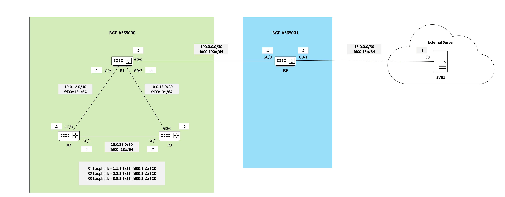

## Overview
This lab demonstrates dual-stack dynamic routing using OSPFv2 (IPv4), OSPFv3 (IPv6), and eBGP between a customer.

## Diagrams
### Logical Topology

## Key Subnets
| Device | Interface | IPv4 | IPv6 |
|--------|-----------|------|------|
| R1 | Gi0/0 | 100.0.0.2/30 | fd00:100::2/64 |
| R1 | Gi0/1 | 10.0.12.1/30 | fd00:12::1/64 |
| R1 | Gi0/2 | 10.0.13.1/30 | fd00:13::1/64 |
| R1 | lo0 | 1.1.1.1/32 | fd00:1::1/128 |
|--------|-----------|------|------|
| R2 | Gi0/0 | 10.0.12.2/30 | fd00:12::2/64 |
| R2 | Gi0/1 | 10.0.23.1/30 | fd00:23::1/64 |
| R2 | lo0 | 2.2.2.2/32 | fd00:2::1/128 |
|--------|-----------|------|------|
| R3 | Gi0/0 | 10.0.13.2/30 | fd00:13::2/64 |
| R3 | Gi0/1 | 10.0.23.2/30 | fd00:23::2/64 |
| R3 | lo0 | 3.3.3.3/32 | fd00:3::1/128 |
|--------|-----------|------|------|
| ISP | Gi0/0 | 100.0.0.1/30 | fd00:100::1/64 |
| ISP | Gi0/1 | 15.0.0.1/30 | fd00:15::2/64 |
| ISP | lo0 | 4.4.4.4/32 | fd00:4::1/128 |
|--------|-----------|------|------|
| SVR | Gi0/1 | 15.0.0.1/30 | fd00:15::1/64 |

## Validations
