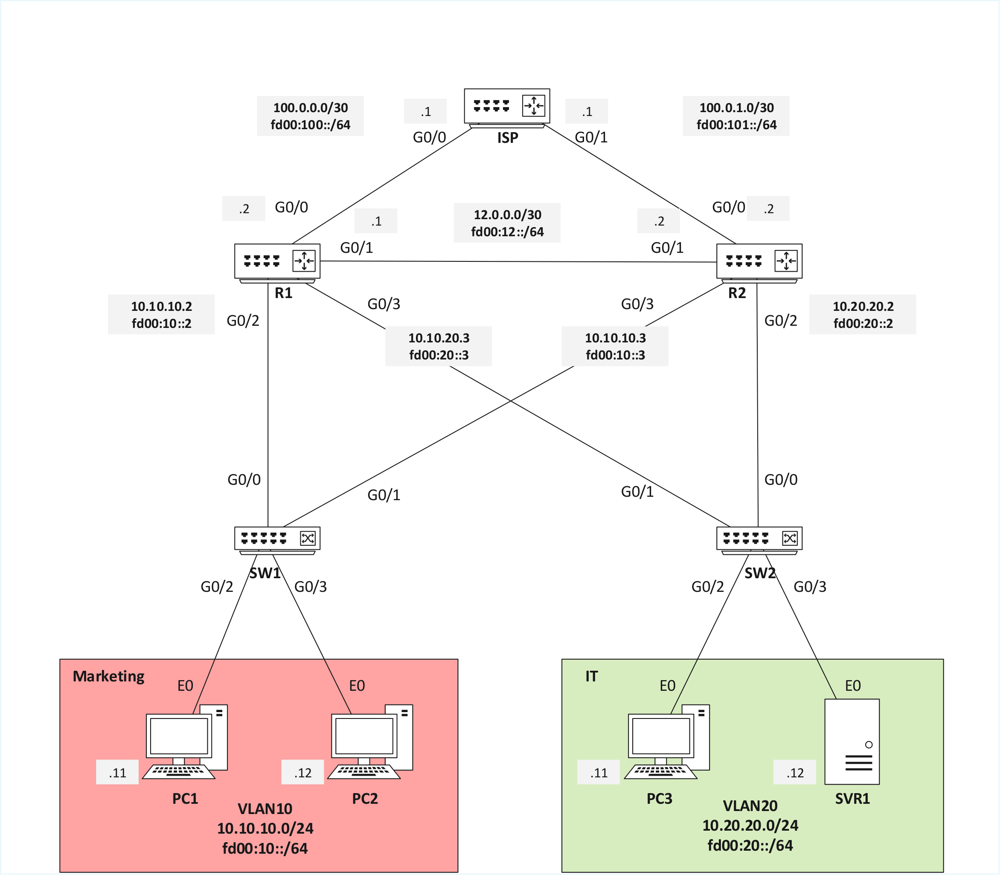

## Overview
This lab demonstrates HSRP active/standby elections, extended ACL placement, and NAT overload (PAT) between an enterprise and an ISP.

## Diagrams
### Topology Overview
- **R1** = Active Edge Router (Customer Edge or CE)
- **R2** = Standby Edge Router (Customer Edge or CE)
- **ISP** = Edge Router (Provider Edge or PE)
- **PC1/PC2/PC3/SVR1** = Enterprise End Hosts
  
### Logical Topology

## Key Subnets
| Device | Interface | IPv4 | IPv6 |
|--------|-----------|------|------|
| R1 | Gi0/0 | 100.0.0.2/30 | fd00:100::2/64 |
| R1 | Gi0/1 | 12.0.0.1/30 | fd00:12::1/64 |
| R1 | Gi0/2 | 10.10.10.2/30 | fd00:10::2/64 |
| R1 | Gi0/3 | 10.20.20.3/30 | fd00:20::3/64 |
| R1 | lo0 | 1.1.1.1/32 | fd00:1::1/128 |
|--------|-----------|------|------|
| R2 | Gi0/0 | 100.0.1.2/30 | fd00:101::2/64 |
| R2 | Gi0/1 | 12.0.0.2/30 | fd00:12::2/64 |
| R2 | Gi0/2 | 10.20.20.2/30 | fd00:20::2/64 |
| R2 | Gi0/3 | 10.10.10.3/30 | fd00:10::3/64 |
| R2 | lo0 | 2.2.2.2/32 | fd00:2::1/128 |
|--------|-----------|------|------|
| ISP | Gi0/0 | 100.0.0.1/30 | fd00:100::1/64 |
| ISP | Gi0/1 | 100.0.1.1/30 | fd00:101::1/64 |
| ISP | lo0 | 3.3.3.3/32 | fd00:3::1/128 |
|--------|-----------|------|------|
| PC1 | ETH0 | 10.10.10.11/24 | fd00:10::11/64 |
| PC2 | ETH0 | 10.10.10.12/24 | fd00:10::12/64 |
| PC3 | ETH0 | 10.20.20.11/24 | fd00:20::11/64 |
| SVR | ETH0 | 10.20.20.12/24 | fd00:20::12/64 |

## Lab Key Takeaways
1. HSRP allows for both IPv4 and IPv6, utilizing version 2
2. ACLs will implicitly drop traffic that doesn't fall within their requirements
3. NAT may be used for legacy constraints on older hardware
4. Dual-stack networks are modern-day networks
5. HA design incorporates many different components/protocols for true failover/redundancy
